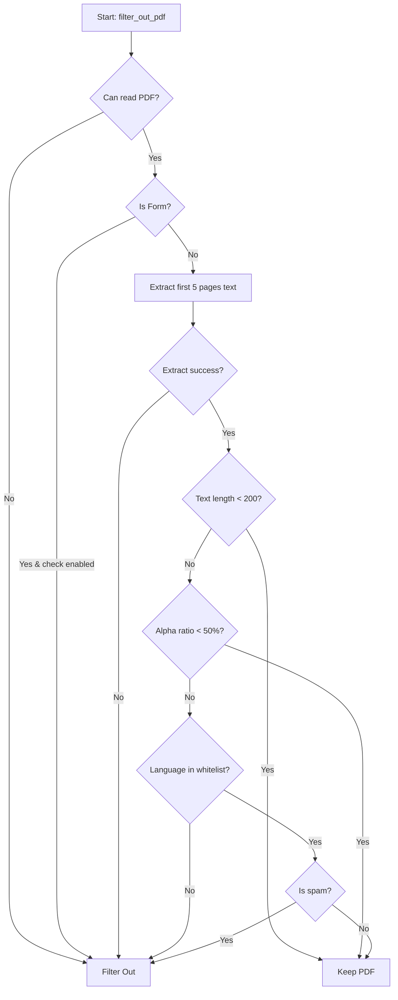

## Overview

The `filter` module provides the `PdfFilter` class for identifying and filtering out low-quality, spam, or unsuitable PDF documents before processing. It performs language detection, form detection, and spam detection.

## PdfFilter Class

```python
from olmocr.filter import PdfFilter

filter = PdfFilter(
    languages_to_keep=[Language.ENGLISH],
    apply_form_check=True,
    apply_download_spam_check=True,
    download_spam_threshold=0.004
)
```

### Constructor Parameters

<ParamField path="languages_to_keep" type="List[Language]" default="[Language.ENGLISH]">
  List of languages to accept. PDFs in other languages will be filtered out. Use `None` in the list to keep documents where language detection fails (potentially OCR'd documents).
</ParamField>

<ParamField path="apply_form_check" type="bool" default="true">
  Enable detection and filtering of PDF forms
</ParamField>

<ParamField path="apply_download_spam_check" type="bool" default="true">
  Enable detection of SEO/download spam documents
</ParamField>

<ParamField path="download_spam_threshold" type="float" default="0.004">
  Threshold for spam word ratio (0.004 = 0.4% of words are spam-related)
</ParamField>

## Methods

### filter_out_pdf

Main filtering method that determines whether a PDF should be excluded from processing.

```python
def filter_out_pdf(local_pdf_path: str) -> bool
```

<ParamField path="local_pdf_path" type="str" required>
  Path to the local PDF file to analyze
</ParamField>

**Returns:** `True` if the PDF should be filtered out (excluded), `False` if it should be kept

#### Filter Criteria

A PDF is filtered out if:

1. **Read Error** - Unable to open or read the PDF
2. **Form Detection** - PDF contains form fields (when `apply_form_check=True`)
3. **Text Length** - Document has sufficient text (≥200 chars) for analysis
4. **Alpha Ratio** - Less than 50% alphabetic characters (kept on "safe side")
5. **Language** - Primary language not in `languages_to_keep`
6. **Spam Detection** - SEO/download spam score exceeds threshold

### Example Usage

```python
from olmocr.filter import PdfFilter
from lingua import Language

# Initialize filter for English documents
pdf_filter = PdfFilter(
    languages_to_keep=[Language.ENGLISH],
    apply_form_check=True,
    apply_download_spam_check=True,
    download_spam_threshold=0.004
)

# Check if a PDF should be filtered
if pdf_filter.filter_out_pdf("/path/to/document.pdf"):
    print("PDF filtered out")
else:
    print("PDF accepted for processing")
```

### Multi-language Example

```python
from olmocr.filter import PdfFilter
from lingua import Language

# Accept English and Spanish documents, plus undetectable languages
pdf_filter = PdfFilter(
    languages_to_keep=[Language.ENGLISH, Language.SPANISH, None],
    apply_form_check=True,
    apply_download_spam_check=True
)
```

### Disable Specific Checks

```python
# Only filter by language, skip form and spam checks
pdf_filter = PdfFilter(
    languages_to_keep=[Language.ENGLISH],
    apply_form_check=False,
    apply_download_spam_check=False
)
```

## Language Enum

The filter uses the `lingua` library for language detection. Common language values:

```python
from lingua import Language

# Common languages
Language.ENGLISH
Language.SPANISH
Language.FRENCH
Language.GERMAN
Language.CHINESE
Language.JAPANESE
# ... and many more
```

See the [lingua-language-detector documentation](https://github.com/pemistahl/lingua-py) for the full list of supported languages.

## Internal Methods

### _is_form

```python
def _is_form(pdf_reader) -> bool
```

Detects if a PDF contains form fields using PyPDF's form detection.

### _is_download_spam

```python
def _is_download_spam(base_text: str) -> bool
```

Analyzes text for spam keywords and calculates a spam score.

**Spam Keywords Detected:**
- download, pdf, epub, mobi
- free, ebook, file, save
- casino, viagra, cialis, ciprofloxacin

A document is considered spam if the ratio of spam words to total words exceeds `download_spam_threshold`.

## Filtering Workflow



## Text Extraction

The filter uses `pdftotext` to extract text from the first 5 pages:

```python
subprocess.run(
    ["pdftotext", "-f", "1", "-l", "5", local_pdf_path, "-"],
    timeout=60,
    stdout=subprocess.PIPE,
    stderr=subprocess.PIPE,
)
```

<Warning>
  Requires `pdftotext` to be installed on the system (part of poppler-utils).
</Warning>

## Performance Considerations

<Card title="Safe-side Filtering" icon="shield-check">
  When text analysis is ambiguous (too short, low alpha ratio), the filter errs on the side of keeping documents to avoid false negatives.
</Card>

<Card title="First 5 Pages Only" icon="file">
  Language and spam detection only analyze the first 5 pages for performance. This is typically sufficient for accurate classification.
</Card>

<Card title="Timeout Protection" icon="clock">
  Text extraction has a 60-second timeout to prevent hanging on corrupted files.
</Card>

## Batch Processing Example

```python
from olmocr.filter import PdfFilter
from lingua import Language
from tqdm import tqdm

pdf_filter = PdfFilter(
    languages_to_keep=[Language.ENGLISH, None],
    apply_download_spam_check=True,
    apply_form_check=True,
)

pdf_paths = [...]  # Your list of PDF paths

keep_paths = []
remove_paths = []

for pdf_path in tqdm(pdf_paths, desc="Filtering PDFs"):
    if pdf_filter.filter_out_pdf(pdf_path):
        remove_paths.append(pdf_path)
    else:
        keep_paths.append(pdf_path)

print(f"Kept: {len(keep_paths)}, Removed: {len(remove_paths)}")
```

## Related APIs

- [Silver Data Generation](/api/buildsilver) - Uses PdfFilter before processing
- [Prompts API](/api/prompts) - Prompt construction for accepted PDFs
