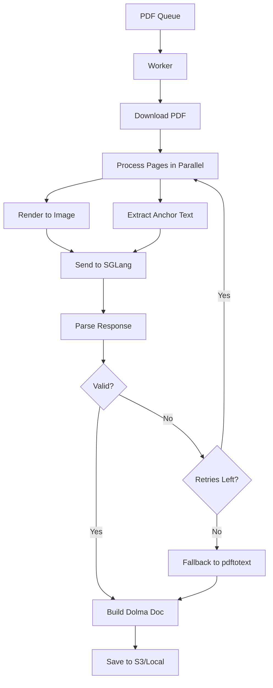

The `olmocr.pipeline` module provides the core functionality for running batch inference on PDF documents using vision-language models.

## Overview

The pipeline module orchestrates the entire OCR workflow:
- Downloads PDFs from S3 or local storage
- Renders PDF pages to images
- Extracts anchor text for context
- Runs vision-language model inference
- Outputs results in Dolma document format

## Command Line Interface

Run the pipeline using:

```bash
python -m olmocr.pipeline <workspace> [options]
```

### Required Arguments

<ParamField path="workspace" type="string" required>
  The filesystem path where work will be stored. Can be a local folder or an S3 path for coordinating work across multiple workers.
  
  Example: `s3://bucket/prefix/` or `/local/path/workspace`
</ParamField>

### PDF Input Options

<ParamField path="--pdfs" type="list[string]">
  Path(s) to add PDFs stored in S3 to the workspace. Can be:
  - S3 glob pattern: `s3://bucket/prefix/*.pdf`
  - Path to file containing list of PDF paths
  - Direct path to a single PDF file
  
  Example: `--pdfs s3://my-bucket/documents/*.pdf`
</ParamField>

<ParamField path="--workspace_profile" type="string">
  S3 configuration profile for accessing the workspace.
  
  Default: `None` (uses default AWS credentials)
</ParamField>

<ParamField path="--pdf_profile" type="string">
  S3 configuration profile for accessing the raw PDF documents.
  
  Default: `None` (uses default AWS credentials)
</ParamField>

### Work Queue Configuration

<ParamField path="--pages_per_group" type="int">
  Target number of PDF pages per work item group. The pipeline samples PDFs to estimate average page count and groups work items accordingly.
  
  Default: `500`
</ParamField>

<ParamField path="--max_page_retries" type="int">
  Maximum number of times to retry rendering a page if it fails or produces invalid results.
  
  Default: `8`
</ParamField>

<ParamField path="--max_page_error_rate" type="float">
  Maximum rate of allowable failed pages in a document. Documents exceeding this rate are discarded.
  
  Default: `0.004` (1/250 pages)
</ParamField>

<ParamField path="--workers" type="int">
  Number of concurrent workers to run at a time. Each worker processes a batch of PDFs in parallel.
  
  Default: `8`
</ParamField>

<ParamField path="--apply_filter" type="boolean">
  Apply basic filtering to keep only English PDFs which are not forms and not likely SEO spam.
  
  Default: `False`
</ParamField>

### Model Configuration

<ParamField path="--model" type="string">
  Path or identifier for the vision-language model. Can be a HuggingFace model ID or a custom path.
  
  Default: `"allenai/olmOCR-7B-0225-preview"`
</ParamField>

<ParamField path="--model_max_context" type="int">
  Maximum context length that the model was fine-tuned under.
  
  Default: `8192`
</ParamField>

<ParamField path="--model_chat_template" type="string">
  Chat template to pass to the SGLang server for formatting prompts.
  
  Default: `"qwen2-vl"`
</ParamField>

<ParamField path="--target_longest_image_dim" type="int">
  Dimension on the longest side to use for rendering PDF pages to images.
  
  Default: `1024`
</ParamField>

<ParamField path="--target_anchor_text_len" type="int">
  Maximum amount of anchor text to extract (in characters) for providing context to the model.
  
  Default: `6000`
</ParamField>

### Beaker Integration

<ParamField path="--beaker" type="boolean">
  Submit this job to Beaker instead of running locally.
  
  Default: `False`
</ParamField>

<ParamField path="--beaker_workspace" type="string">
  Beaker workspace to submit jobs to.
  
  Default: `"ai2/olmocr"`
</ParamField>

<ParamField path="--beaker_cluster" type="list[string]">
  Beaker cluster(s) you want to run on.
  
  Default: `["ai2/jupiter-cirrascale-2", "ai2/ceres-cirrascale", ...]`
</ParamField>

<ParamField path="--beaker_gpus" type="int">
  Number of GPU replicas to run.
  
  Default: `1`
</ParamField>

<ParamField path="--beaker_priority" type="string">
  Beaker priority level for the job.
  
  Default: `"normal"`
</ParamField>

### Statistics

<ParamField path="--stats" type="boolean">
  Instead of running any job, report statistics about the current workspace including completed items, token counts, and progress.
  
  Default: `False`
</ParamField>

## Core Classes

### PageResult

Represents the result of processing a single PDF page.

<ResponseField name="s3_path" type="string">
  Original S3 path or local path to the PDF document.
</ResponseField>

<ResponseField name="page_num" type="int">
  Page number within the PDF (1-indexed).
</ResponseField>

<ResponseField name="response" type="PageResponse">
  The structured response from the vision-language model containing:
  - `natural_text`: Extracted text content
  - `primary_language`: Detected language
  - `is_rotation_valid`: Whether page rotation is correct
  - `rotation_correction`: Degrees to rotate if invalid
  - `is_table`: Whether page contains tables
  - `is_diagram`: Whether page contains diagrams
</ResponseField>

<ResponseField name="input_tokens" type="int">
  Number of input tokens used for this page.
</ResponseField>

<ResponseField name="output_tokens" type="int">
  Number of output tokens generated for this page.
</ResponseField>

<ResponseField name="is_fallback" type="boolean">
  Whether this page used fallback extraction (pdftotext) due to processing failures.
</ResponseField>

## Key Functions

### build_page_query

Builds a query payload for processing a single PDF page.

```python
async def build_page_query(
    local_pdf_path: str,
    page: int,
    target_longest_image_dim: int,
    target_anchor_text_len: int,
    image_rotation: int = 0
) -> dict
```

<ParamField path="local_pdf_path" type="string" required>
  Path to the PDF file on local disk.
</ParamField>

<ParamField path="page" type="int" required>
  Page number to process (1-indexed).
</ParamField>

<ParamField path="target_longest_image_dim" type="int" required>
  Target dimension for the longest side of the rendered image.
</ParamField>

<ParamField path="target_anchor_text_len" type="int" required>
  Maximum characters of anchor text to extract.
</ParamField>

<ParamField path="image_rotation" type="int">
  Rotation angle to apply to the image (0, 90, 180, or 270 degrees).
  
  Default: `0`
</ParamField>

**Returns:** Dictionary containing the API request payload with model, messages, max_tokens, and temperature.

### process_page

Processes a single PDF page through the inference pipeline.

```python
async def process_page(
    args,
    worker_id: int,
    pdf_orig_path: str,
    pdf_local_path: str,
    page_num: int
) -> PageResult
```

Handles retries, rotation correction, and fallback to pdftotext if processing fails.

### process_pdf

Processes an entire PDF document.

```python
async def process_pdf(
    args,
    worker_id: int,
    pdf_orig_path: str
) -> Optional[dict]
```

Downloads the PDF, processes all pages concurrently, applies filtering, and builds a Dolma document.

**Returns:** Dolma document dict or `None` if processing failed or document was filtered out.

### build_dolma_document

Constructs a Dolma-format document from page results.

```python
def build_dolma_document(
    pdf_orig_path: str,
    page_results: List[PageResult]
) -> Optional[dict]
```

**Returns:** Dictionary with structure:
```json
{
  "id": "<sha1-hash>",
  "text": "<full-document-text>",
  "source": "olmocr",
  "added": "2024-01-01",
  "created": "2024-01-01",
  "metadata": {
    "Source-File": "s3://...",
    "olmocr-version": "0.1.0",
    "pdf-total-pages": 10,
    "total-input-tokens": 5000,
    "total-output-tokens": 3000,
    "total-fallback-pages": 0
  },
  "attributes": {
    "pdf_page_numbers": [[0, 100, 1], [100, 200, 2], ...]
  }
}
```

## Usage Examples

### Basic Local Processing

```bash
python -m olmocr.pipeline ./workspace \
  --pdfs document.pdf \
  --workers 4
```

### S3 Workspace with Multiple Workers

```bash
python -m olmocr.pipeline s3://my-bucket/workspace \
  --pdfs "s3://pdf-bucket/documents/*.pdf" \
  --workers 16 \
  --pages_per_group 1000
```

### Using Custom Model

```bash
python -m olmocr.pipeline ./workspace \
  --pdfs "s3://my-pdfs/*.pdf" \
  --model "allenai/custom-ocr-model" \
  --model_max_context 16384 \
  --target_longest_image_dim 2048
```

### Submitting to Beaker

```bash
python -m olmocr.pipeline s3://my-bucket/workspace \
  --pdfs "s3://pdf-bucket/documents/*.pdf" \
  --beaker \
  --beaker_gpus 8 \
  --beaker_workspace "ai2/olmocr" \
  --beaker_priority "high"
```

### Checking Workspace Statistics

```bash
python -m olmocr.pipeline s3://my-bucket/workspace --stats
```

Output:
```
Work Items Status:
Total work items: 1,000
Completed items: 750
Remaining items: 250

Results:
Total documents processed: 7,200
Total pages processed: 72,000
Average pages per doc: 10.0
Average output tokens per doc: 4,250.5
```

## Architecture

The pipeline uses an async architecture with:

1. **SGLang Server**: Manages the vision-language model inference
2. **Work Queue**: Distributes PDF processing tasks across workers
3. **Workers**: Process PDFs concurrently, each handling multiple pages in parallel
4. **Process Pool**: Offloads CPU-bound tasks (anchor text extraction)
5. **Metrics System**: Tracks token usage and throughput

### Workflow



## Error Handling

The pipeline implements robust error handling:

- **Page-level retries**: Up to `--max_page_retries` attempts per page
- **Rotation correction**: Automatically detects and corrects rotated pages
- **Fallback extraction**: Uses pdftotext when VLM processing fails
- **Document-level filtering**: Discards documents exceeding error rate threshold
- **Exponential backoff**: For server connection issues
- **Graceful degradation**: Continues processing other documents on failure

## Performance Considerations

- **Concurrent processing**: Multiple workers process PDFs in parallel
- **Async I/O**: Non-blocking downloads and uploads
- **Process pool**: CPU-bound anchor text extraction runs in separate processes
- **Semaphore control**: Prevents queue saturation while maximizing GPU utilization
- **Batch grouping**: Groups PDFs by estimated page count for balanced workloads

## Related

- [Work Queue API](/api/work-queue) - Queue management system
- [Rendering API](/api/rendering) - PDF rendering utilities
