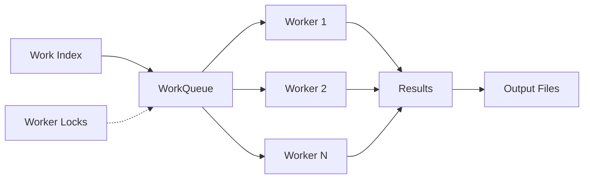

The `olmocr.work_queue` module provides a flexible work queue system that supports both local and S3-backed distributed processing.

## Overview

The work queue system enables:
- Distribution of PDF processing work across multiple workers
- Resumable processing with persistent state
- Lock-based coordination to prevent duplicate work
- Support for both local single-machine and distributed multi-machine setups

## Architecture



## Core Classes

### WorkItem

Represents a single unit of work in the queue.

```python
@dataclass
class WorkItem:
    hash: str
    work_paths: List[str]
```

<ResponseField name="hash" type="string">
  SHA1 hash computed from the sorted list of work paths. Used as a unique identifier for the work item.
</ResponseField>

<ResponseField name="work_paths" type="list[string]">
  List of PDF paths (S3 or local) to process together as a batch.
</ResponseField>

### WorkQueue (Abstract Base Class)

Defines the interface that all work queue implementations must follow.

```python
class WorkQueue(abc.ABC):
    @abc.abstractmethod
    async def populate_queue(
        self,
        work_paths: List[str],
        items_per_group: int
    ) -> None:
        pass

    @abc.abstractmethod
    async def initialize_queue(self) -> None:
        pass

    @abc.abstractmethod
    async def is_completed(self, work_hash: str) -> bool:
        pass

    @abc.abstractmethod
    async def get_work(
        self,
        worker_lock_timeout_secs: int = 1800
    ) -> Optional[WorkItem]:
        pass

    @abc.abstractmethod
    async def mark_done(self, work_item: WorkItem) -> None:
        pass

    @property
    @abc.abstractmethod
    def size(self) -> int:
        pass
```

#### Methods

##### populate_queue

Adds new PDF paths to the work queue.

<ParamField path="work_paths" type="list[string]" required>
  List of individual PDF paths to add to the queue. These will be grouped into work items.
</ParamField>

<ParamField path="items_per_group" type="int" required>
  Number of PDF paths to group together in a single WorkItem. Allows batching for efficiency.
</ParamField>

**Behavior:**
- Computes hash for each group of paths
- Skips paths already in the index
- Writes updated index to storage (zstd-compressed CSV)

##### initialize_queue

Loads the work queue from persistent storage and prepares it for processing.

**Behavior:**
- Reads work index from storage
- Identifies completed work items
- Filters out completed items
- Randomizes remaining work order
- Populates internal queue

##### is_completed

Checks if a work item has been completed.

<ParamField path="work_hash" type="string" required>
  Hash identifier of the work item to check.
</ParamField>

**Returns:** `True` if output file exists, `False` otherwise.

##### get_work

Retrieves the next available work item.

<ParamField path="worker_lock_timeout_secs" type="int">
  Number of seconds before considering a worker lock stale and reclaiming the work.
  
  Default: `1800` (30 minutes)
</ParamField>

**Returns:** `WorkItem` if work is available, `None` if queue is empty.

**Behavior:**
- Pulls next item from internal queue
- Checks if already completed (skips if yes)
- Checks for active worker lock
- Creates new lock if work is available
- Retries next item if current is locked/completed

##### mark_done

Marks a work item as complete.

<ParamField path="work_item" type="WorkItem" required>
  The work item to mark as done.
</ParamField>

**Behavior:**
- Removes worker lock file
- Marks internal queue task as done

##### size

**Returns:** Current number of items remaining in the queue.

#### Static Methods

##### _compute_workgroup_hash

Computes a deterministic hash for a group of paths.

```python
@staticmethod
def _compute_workgroup_hash(work_paths: List[str]) -> str:
    sha1 = hashlib.sha1()
    for path in sorted(work_paths):
        sha1.update(path.encode("utf-8"))
    return sha1.hexdigest()
```

<ParamField path="work_paths" type="list[string]" required>
  List of paths to hash.
</ParamField>

**Returns:** SHA1 hexadecimal hash string.

## LocalWorkQueue

Local filesystem-based work queue implementation for single-machine processing.

```python
class LocalWorkQueue(WorkQueue):
    def __init__(self, workspace_path: str):
        ...
```

### Constructor

<ParamField path="workspace_path" type="string" required>
  Local directory path where the queue index, results, and locks are stored.
</ParamField>

### File Structure

```
workspace_path/
├── work_index_list.csv.zstd    # Compressed index of all work items
├── results/
│   ├── output_<hash1>.jsonl    # Completed work outputs
│   └── output_<hash2>.jsonl
└── worker_locks/
    ├── output_<hash3>.jsonl    # Active worker locks
    └── output_<hash4>.jsonl
```

### Example Usage

```python
import asyncio
from olmocr.work_queue import LocalWorkQueue

async def main():
    # Initialize queue
    queue = LocalWorkQueue("./my_workspace")
    
    # Add PDFs to queue
    pdf_paths = [
        "/path/to/doc1.pdf",
        "/path/to/doc2.pdf",
        "/path/to/doc3.pdf",
    ]
    await queue.populate_queue(pdf_paths, items_per_group=2)
    
    # Initialize for processing
    await queue.initialize_queue()
    print(f"Queue size: {queue.size}")
    
    # Get work
    work_item = await queue.get_work()
    if work_item:
        print(f"Processing: {work_item.work_paths}")
        # ... do processing ...
        await queue.mark_done(work_item)

asyncio.run(main())
```

## S3WorkQueue

S3-backed work queue for distributed multi-machine processing.

```python
class S3WorkQueue(WorkQueue):
    def __init__(self, s3_client, workspace_path: str):
        ...
```

### Constructor

<ParamField path="s3_client" type="boto3.client" required>
  Boto3 S3 client instance for S3 operations.
</ParamField>

<ParamField path="workspace_path" type="string" required>
  S3 path (e.g., `s3://bucket/prefix/`) where queue index, results, and locks are stored.
</ParamField>

### S3 Structure

```
s3://bucket/prefix/
├── work_index_list.csv.zstd        # Compressed index
├── results/
│   ├── output_<hash1>.jsonl        # Completed outputs
│   └── output_<hash2>.jsonl
└── worker_locks/
    ├── output_<hash3>.jsonl        # Active locks
    └── output_<hash4>.jsonl
```

### Work Distribution Mechanism

1. **Initialization**: Each worker loads the full work index from S3
2. **Randomization**: Work items are shuffled independently on each worker
3. **Lock-based coordination**: Workers attempt to acquire locks when pulling work
4. **Stale lock recovery**: Locks older than timeout are reclaimed
5. **Completion tracking**: Output files serve as completion markers

### Example Usage

```python
import asyncio
import boto3
from olmocr.work_queue import S3WorkQueue

async def main():
    # Initialize S3 client and queue
    s3_client = boto3.client("s3")
    queue = S3WorkQueue(s3_client, "s3://my-bucket/workspace/")
    
    # Add S3 PDFs to queue
    pdf_paths = [
        "s3://pdf-bucket/doc1.pdf",
        "s3://pdf-bucket/doc2.pdf",
        "s3://pdf-bucket/doc3.pdf",
    ]
    await queue.populate_queue(pdf_paths, items_per_group=2)
    
    # Initialize for processing
    await queue.initialize_queue()
    print(f"Queue size: {queue.size}")
    
    # Process work (can run on multiple machines)
    while True:
        work_item = await queue.get_work(worker_lock_timeout_secs=1800)
        if work_item is None:
            break
            
        print(f"Processing: {work_item.work_paths}")
        # ... do processing ...
        # ... upload results to S3 ...
        await queue.mark_done(work_item)

asyncio.run(main())
```

## Multi-Worker Pattern

```python
import asyncio
from olmocr.work_queue import S3WorkQueue

async def worker(queue, worker_id):
    """Process work items until queue is empty"""
    while True:
        work_item = await queue.get_work()
        if work_item is None:
            print(f"Worker {worker_id}: No more work")
            break
            
        print(f"Worker {worker_id}: Processing {work_item.hash}")
        # ... process PDFs in work_item.work_paths ...
        await queue.mark_done(work_item)

async def main():
    s3_client = boto3.client("s3")
    queue = S3WorkQueue(s3_client, "s3://bucket/workspace/")
    
    await queue.initialize_queue()
    
    # Run 8 workers concurrently
    workers = [
        asyncio.create_task(worker(queue, i))
        for i in range(8)
    ]
    
    await asyncio.gather(*workers)
    print("All work completed!")

asyncio.run(main())
```

## Work Index Format

The work index is stored as a zstd-compressed CSV file:

```csv
hash1,s3://bucket/doc1.pdf,s3://bucket/doc2.pdf
hash2,s3://bucket/doc3.pdf,s3://bucket/doc4.pdf
hash3,s3://bucket/doc5.pdf
```

Each line represents one WorkItem:
- First column: SHA1 hash of the sorted paths
- Remaining columns: PDF paths in the work group

## Lock Mechanism

Worker locks prevent duplicate processing:

1. Worker calls `get_work()`
2. Queue creates empty lock file: `worker_locks/output_<hash>.jsonl`
3. Lock file timestamp tracks when work started
4. Other workers skip locked items (unless stale)
5. Worker calls `mark_done()` to remove lock
6. Completed output file: `results/output_<hash>.jsonl` serves as permanent completion marker

## Error Recovery

### Stale Locks

If a worker crashes, its locks become stale after `worker_lock_timeout_secs`. Other workers can reclaim this work.

### Resumable Processing

The queue system is fully resumable:
- Completed work items are never re-processed
- Active locks prevent duplicate work
- Workers can join/leave at any time
- Progress persists across restarts

## Performance Considerations

### Batching

Grouping multiple PDFs per work item (`items_per_group`) provides several benefits:
- Reduces lock file overhead
- Amortizes S3 API call costs
- Enables better load balancing

### Randomization

Shuffling work items on each worker:
- Reduces lock contention
- Improves parallel efficiency
- Distributes large documents across workers

### Optimal Group Size

The pipeline estimates optimal `items_per_group` based on:
- Target pages per group (default: 500)
- Average pages per PDF (sampled from input)

## Related

- [Pipeline Module](/api/pipeline) - Main processing pipeline
- [Rendering API](/api/rendering) - PDF rendering functions
