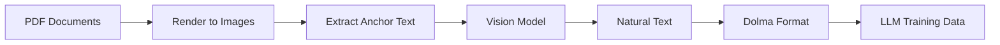

## What is olmOCR?

olmOCR is a comprehensive toolkit for training language models to work with PDF documents in the wild. It transforms PDFs into high-quality training data by combining vision-language models with intelligent text extraction techniques.

<CardGroup cols={2}>
  <Card title="PDF Processing" icon="file-pdf">
    Convert millions of PDFs to LLM-ready text using fine-tuned vision models
  </Card>
  <Card title="Training Pipeline" icon="brain">
    Fine-tune Qwen2-VL and Molmo-O models on your PDF data
  </Card>
  <Card title="Evaluation Tools" icon="chart-line">
    Side-by-side comparison of different pipeline versions
  </Card>
  <Card title="Distributed Processing" icon="server">
    Scale to millions of documents with S3 and work queue coordination
  </Card>
</CardGroup>

## Core Components

olmOCR consists of four main components that work together to create a complete PDF-to-training-data pipeline:

### 1. Data Preparation (`buildsilver.py`)

Creates high-quality silver training data using ChatGPT 4o with a specialized prompting strategy. This component:

- Extracts natural text from PDF pages using vision models
- Combines anchor text hints with visual understanding
- Produces ground truth examples for fine-tuning

### 2. Inference Pipeline (`pipeline.py`)

The heart of olmOCR - processes millions of PDFs through fine-tuned models:

- **Local mode**: Process PDFs on a single GPU machine
- **Distributed mode**: Coordinate work across multiple nodes via S3
- **Work queue**: Manages job distribution and prevents duplicate processing
- **Filtering**: Removes low-quality documents (SEO spam, non-English, forms)

<Tip>
The pipeline can process PDFs locally or scale to millions of documents using S3 and distributed workers on Beaker.
</Tip>

### 3. Training (`train.py`)

Fine-tunes vision-language models to understand PDF layouts:

- Supports Qwen2-VL and Molmo-O architectures
- Trains models to extract natural text from rendered PDF images
- Uses anchor text as context to improve extraction quality

### 4. Evaluation (`runeval.py`)

Compares different pipeline versions side-by-side:

- Visual comparison of original PDFs and extracted text
- Metrics for comparing extraction quality
- Dolma viewer for inspecting results

## How It Works

The olmOCR workflow follows these steps:



### Step-by-Step Process

1. **PDF Rendering**: Each page is rendered to a PNG image at a target resolution (default 1024px longest side)

2. **Anchor Text Extraction**: Multiple extraction methods (pdftotext, pdfium, pypdf) extract raw text to provide context hints

3. **Vision Model Inference**: A fine-tuned VLM (Qwen2-VL or Molmo-O) processes the image and anchor text to produce natural text

4. **Quality Control**: Filtering removes documents that are:
   - Non-English
   - SEO spam or low coherency
   - Forms with mostly structured data
   - Pages with excessive errors

5. **Output Format**: Results are saved in [Dolma](https://github.com/allenai/dolma) JSONL format with metadata:

```json
{
  "id": "<sha1-hash>",
  "text": "Extracted natural text...",
  "source": "olmocr",
  "metadata": {
    "Source-File": "s3://bucket/path/to/file.pdf",
    "olmocr-version": "0.1.0",
    "pdf-total-pages": 10,
    "total-input-tokens": 15000,
    "total-output-tokens": 3000,
    "total-fallback-pages": 0
  },
  "attributes": {
    "pdf_page_numbers": [[0, 500, 1], [501, 1200, 2]]
  }
}
```

## Architecture Principles

### Fault Tolerance

The pipeline is designed to handle failures gracefully:

- **Page-level retries**: Failed pages are retried up to 8 times with exponential backoff
- **Fallback extraction**: If vision model fails, falls back to pdftotext
- **Error rate threshold**: Documents with >0.4% failed pages are discarded
- **Lock files**: Prevent duplicate processing in distributed environments

### Scalability

<CardGroup cols={2}>
  <Card title="Async/Await" icon="bolt">
    Asynchronous processing maximizes GPU utilization
  </Card>
  <Card title="Work Queues" icon="list-check">
    Distributes work across multiple GPU workers
  </Card>
  <Card title="S3 Coordination" icon="cloud">
    Shared state via S3 for multi-node processing
  </Card>
  <Card title="Process Pools" icon="cpu">
    CPU-bound tasks (anchor text) run in separate processes
  </Card>
</CardGroup>

### Efficiency

Key optimizations for processing millions of PDFs:

- **Batching**: Groups ~500 pages per work item for optimal GPU utilization
- **Concurrent workers**: Default 8 workers per GPU node
- **Semaphore control**: Ensures GPU stays saturated without memory overflow
- **Manual HTTP**: Custom async HTTP implementation avoids connection pool deadlocks at scale

<Note>
At 100M+ requests, standard HTTP libraries can experience deadlocks. olmOCR uses a custom `apost()` function to avoid this issue.
</Note>

## Output and Results

Processed documents are stored in Dolma format with:

- **Text**: Natural reading-order text extracted from the PDF
- **Page spans**: Character offsets mapping text back to original page numbers
- **Metadata**: Token counts, version info, source file location
- **Quality metrics**: Fallback page counts, total pages processed

### Viewing Results

Use the built-in Dolma viewer to see side-by-side comparisons:

```bash
python -m olmocr.viewer.dolmaviewer localworkspace/results/output_*.jsonl
```

This generates HTML files showing the original PDF alongside the extracted text.

## Next Steps

<CardGroup cols={2}>
  <Card title="Pipeline Details" icon="diagram-project" href="/concepts/pipeline">
    Learn about the inference pipeline architecture
  </Card>
  <Card title="Anchor Text" icon="anchor" href="/concepts/anchor-text">
    Understand how anchor text improves extraction
  </Card>
  <Card title="Quick Start" icon="rocket" href="/quickstart">
    Start processing PDFs in minutes
  </Card>
  <Card title="API Reference" icon="code" href="/api/pipeline">
    Explore the API documentation
  </Card>
</CardGroup>